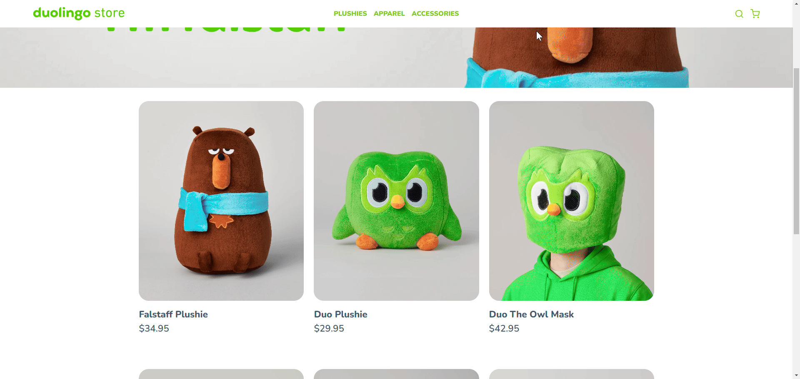
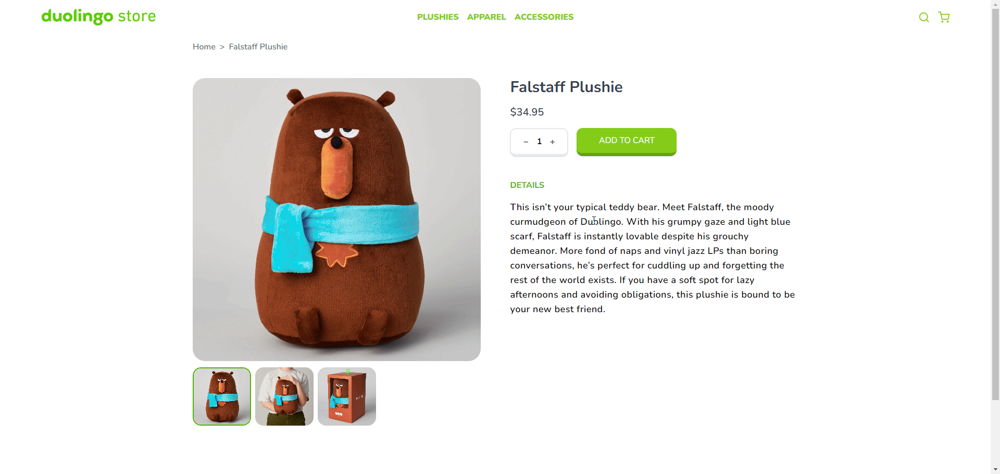

<div align="center" width="100px">

</div>

<hr />

<div id="readme">
<p align="center">
    <a href="https://zuolingo.vercel.app/">View Demo</a>
    ·
    <a href="https://github.com/mkamburdev/Zuolingo/issues">Report Bug</a>
    ·
    <a href="https://github.com/mkamburdev/Zuolingo/issues/new">Request Feature</a>
  </p>
</div>

<!-- TABLE OF CONTENTS -->
<details open="true">
  <summary>Table of Contents</summary>
  <ul>
    <li><a href="#screenshots">Screenshots</a></li>
    <li><a href="#ziele-und-funktionen">Ziele und Funktionen</a></li>
    <li><a href="#entwicklungsplan">Entwicklungsplan</a></li>
    <li><a href="#development-plan">Development Plan</a></li>
    <li><a href="#technologien">Technologien</a></li>
    <li><a href="#schriftarten--fotos">Schriftarten & Fotos</a></li>
    <li><a href="#was-ich-gelernt-habe">Was ich gelernt habe</a></li>
    <li><a href="#herausforderungen">Herausforderungen</a></li>
    <li><a href="#erste-schritte">Erste Schritte</a></li>
    <li><a href="#demo">Demo</a></li>
		<li><a href="#kontakt">Kontakt</a></li>
  </ul>
</details>

Dieses Projekt ist eine E-Commerce-Plattform mit einer einfachen Benutzeroberfläche, die mit modernen Webtechnologien entwickelt wurde. Ich habe versucht, sie anzupassen, um dem Design der Online-Shop-Seite von [Duolingo](https://store.duolingo.com/) zu ähneln, zu Bildungszwecken. Fortgeschrittene Funktionen von React, React Router sowie Zustandsverwaltung und Seitenrouting-Fähigkeiten wurden genutzt. Diese Plattform ermöglicht es den Nutzern, Produkte zu erkunden, sie in ihren Warenkorb zu legen und Einkäufe zu tätigen, und bietet dabei eine benutzerfreundliche Oberfläche.

## Screenshots

<div align="center">


</div>

<div align="center">

</div>
<br />
<div align="center">

</div>
<br />
<div align="center">

</div>

<p align="right">(<a href="#readme">zurück zum Anfang</a>)</p>

## Ziele und Funktionen

- **Benutzererfahrung priorisieren:**: Eine Plattform schaffen, auf der Nutzer mühelos navigieren, Produkte finden und Einkäufe tätigen können.
- **Dynamische Inhaltsverwaltung:**: Echtzeitaktualisierungen von Produkten und Warenkorbinhalten basierend auf der Nutzerinteraktion gewährleisten.
- **Responsives Design**: Die Benutzeroberfläche so gestalten, dass sie sich nahtlos an verschiedene Geräte und Bildschirmgrößen anpasst.
- **Warenkorbverwaltung**: Einen Bereich bereitstellen, in dem Nutzer Produkte in ihren Warenkorb legen, dessen Inhalte anzeigen und den Warenkorb verwalten können.
- **Produktauflistung**: Produkte in einem Schaufenster präsentieren, wobei hervorgehobene oder rabattierte Artikel besonders betont werden.
- **Produktdetailseite**: Detaillierte Informationen über ein Produkt anzeigen, einschließlich Beschreibung, Preis und Fotos.

<p align="right">(<a href="#readme">zurück zum Anfang</a>)</p>

## Entwicklungsplan

- **Kategorien und Filter**: Optionen, um Produkte nach Kategorien zu filtern.
- **Suche**: Eine Suchfunktion, die es Nutzern ermöglicht, Produkte nach Name oder Kategorie zu finden.
- **Benutzersitzung**: Die Möglichkeit für Nutzer, Konten zu erstellen, sich anzumelden und Sitzungen zu verwalten.
- **Bestellverwaltung**: Ein Bereich, in dem Nutzer ihre Bestellhistorie einsehen und den Status aktueller Bestellungen verfolgen können.
  
<p align="right">(<a href="#readme">zurück zum Anfang</a>)</p>

## Technologien

- HTML
- Tailwind CSS
- JavaScript
- React
- React Router
- Vite
- Git
- Vercel

<p align="right">(<a href="#readme">zurück zum Anfang</a>)</p>

## Schriftarten & Fotos

- Nunito
- Google Font
- Fontawesome Icons
- Duolingo Product Photos

<p align="right">(<a href="#readme">zurück zum Anfang</a>)</p>

## Was ich gelernt habe

- **React und React Router**: Ich habe sowohl grundlegende als auch fortgeschrittene Funktionen dieser Bibliotheken beherrscht, wodurch ich in der Lage bin, Single Page Applications (SPAs) effektiv zu entwickeln.
- **Zustandsverwaltung**: Ich habe gelernt, wie man den Anwendungszustand effektiv verwaltet und dynamisch auf Benutzerinteraktionen reagiert.
- **Prinzipien des responsiven Designs**: Durch die Verwendung von Tailwind CSS und modernen Layout-Techniken habe ich meine Fähigkeit verbessert, Benutzeroberflächen zu entwerfen, die nahtlos auf allen Geräten funktionieren und den erforderlichen Designs entsprechen.

## Herausforderungen
- Das Schwierigste bei der Entwicklung des Projekts war für mich, die Produkte aktuell in den Warenkorb zu legen und die Anzahl der Produkte im Warenkorb zu aktualisieren. Ich kann sagen, dass ich die meiste Zeit dafür aufgewendet habe.

<p align="right">(<a href="#readme">zurück zum Anfang</a>)</p>

## Erste Schritte

This is an example of how you may give instructions on setting up your project locally. To get a local copy up and running follow these simple example steps.

Clone the project:

```bash
git clone git@github.com:mkamburdev/Zuolingo.git
```

Go to the project directory:

```bash
cd Zuolingo
```

Install the required packages:

```bash
npm install
```

Launch the application:

```bash
npm run dev
```

<p align="right">(<a href="#readme">zurück zum Anfang</a>)</p>

## Demo

[https://zuolingo.vercel.app](https://zuolingo.vercel.app/ 'Zuolingo Project | mkamburdev')

<p align="right">(<a href="#readme">zurück zum Anfang</a>)</p>

## Kontakt

Muhammed Kambur - [@mkambur](https://linkedin.com/in/mkambur) - info@mkambur.com


<p align="right">(<a href="#readme">zurück zum Anfang</a>)</p>